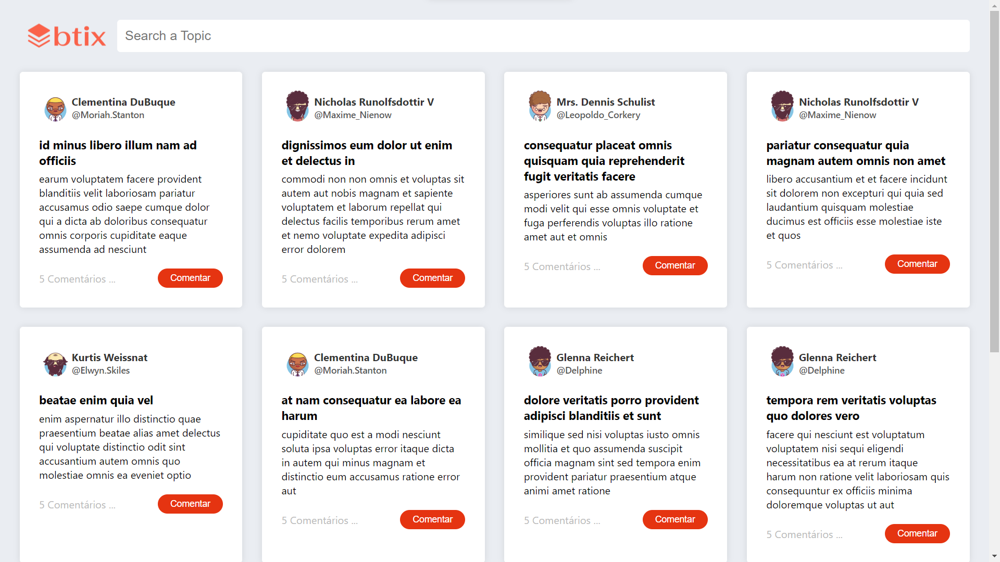
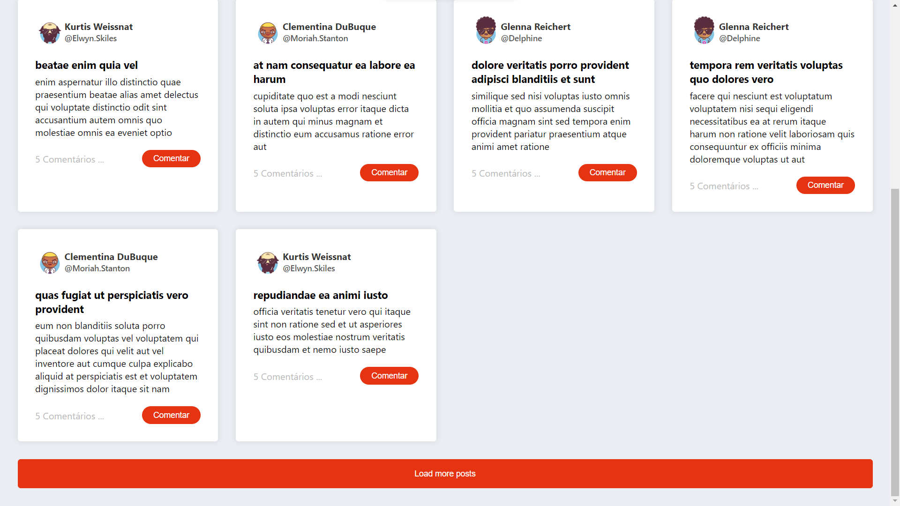
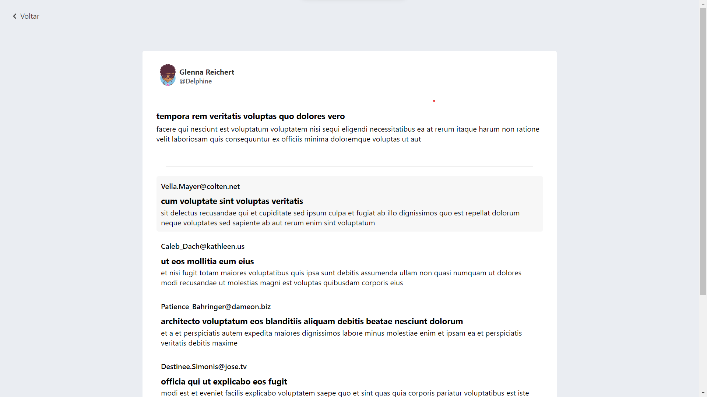
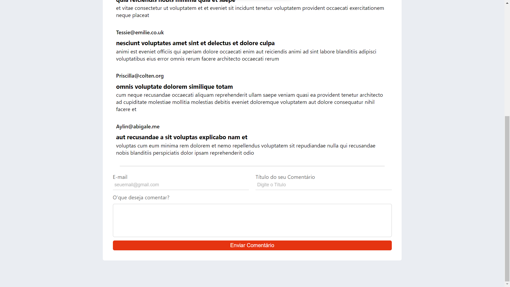

<!-- Título -->

<h1 align="center">Blog BTIX</h1>
<div align="center">

</div>

<!-- Descrição -->

<p align="center">Teste realizado para empresa BTIX, no cenário proposto, a interface deve exibir posts de um blog e, ao clicar em um post, os comentários associados.</p>

<!-- Súmario -->

<p align="center">
 <a href="#demo">Demo</a> •
 <a href="#rodando-a-aplicação">Rodando A Aplicação</a> •
 <a href="#tecnologias">Tecnologias</a> •
 <a href="#autor">Autor</a>
</p>

<br>

---

<br>

## Demo

<br>

<p>Home Screen</p>


<br>

<p>Button Load More Posts</p>


<br>

<p>Post and Comments</p>


<br>

<p>User Profile</p>


<br>

---

<br>

## Rodando A Aplicação

<a href="https://matheuspalmieri.github.io/blog-btix/" target="_blank">Acesso o site do Projeto, clicando aqui.</a>

```
https://matheuspalmieri.github.io/blog-btix/    
```

<br>

### Requirimentos

<br>

- [Node](https://nodejs.org/en/)
- [Yarn](https://classic.yarnpkg.com/lang/en/) or [Npm](https://www.npmjs.com/)

<br>

### Clone o repositório e acesse a pasta
```
$ git clone https://github.com/MatheusPalmieri/BlogBTIX && cd BlogBTIX
```

<br>

### Siga as etapas para rodar o Projeto em sua máquina local
```
$ git clone https://github.com/MatheusPalmieri/BlogBTIX


```


###


---

<br>

## Tecnologias

As seguintes ferramentas foram usadas na construção do projeto:

- [React](https://pt-br.reactjs.org/)
- [JavaScript](https://www.javascript.com/)
- [CSS](https://html.com/css/)
- [React Content Loader](https://www.npmjs.com/package/react-content-loader)
- [Big Heads](https://bigheads.io/)
- [React Router Dom](https://github.com/remix-run/react-router)
<!-- - [Prettier](https://prettier.io/) -->
<!-- - [ESLint](https://eslint.org/) -->
- [Mui Icons](https://mui.com/)

<br>

---

<br>

### Autor

Create for <b>`Matheus Palmieri`</b>👨‍💻

<br>
<br>

<p align="center">🎉Test Blog BTIX Finalizado🚀</p>


### `npm start`

Runs the app in the development mode.\
Open [http://localhost:3000](http://localhost:3000) to view it in your browser.
